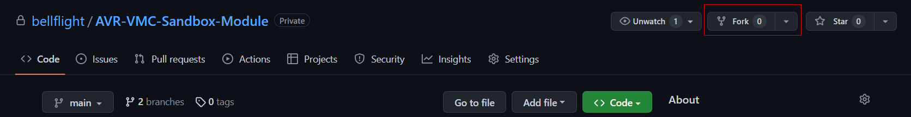

The AVR codebase is currently hosted on GitHub. Not to be confused with Git, GitHub is a
cloud-based hosting service that lets you manage Git repositories. To customize the
software on your drone, we ask you to create your own account, join an organization for
your team, and host a version of that project in GitHub.

## GitHub Account

To get started, follow this [link](https://github.com/join) and create an account. If
you already have a GitHub account, you are free to use that.

## Organizations

You'll want to create a group where you can set access permission for your code to the
rest of your team. In your profile settings,
[add an organization.](https://docs.github.com/en/organizations/collaborating-with-groups-in-organizations/creating-a-new-organization-from-scratch)
If an organization has already been made, ask your team leader for access.

While this isn't strictly necessary, it's highly recommended to facilitate collaboration
across your team.

## Forking a Repo

A template repository has been created for you to base your custom code off of. To make
your own changes, you will need to **fork** the repository.

A fork is a copy of a repository. You will be able to make changes to the code without
modifying the original. To fork the template repository, click on the **fork** button on
the top right of the
[AVR Sandbox Module](https://github.com/bellflight/AVR-VMC-Sandbox-Module). If someone
on your team has already done this, ask them to share access with you.



## Install New Repo on Jetson

Take note of the URL of the repository you just made.


We will need to install this module on the Jetson. Run the following commands:

```bash
cd ~/AVR-VMC/modules
git clone https://github.com/your-organization-here/AVR-VMC-Sandbox-Module sandbox
```

This will clone your new repository into the `sandbox` directory.

## Syncing with the Base Repository

If the base repository receives an update, you may want to update your code fork to
include those new changes. Updating your forked repo is simple in GitHub. Navigate to
the main page of your repo, and select this "sync" option:


This option will allow you to see if your repository is behind. If it needs an update,
simply select "Update branch" and sync the repository with your Jetson.
